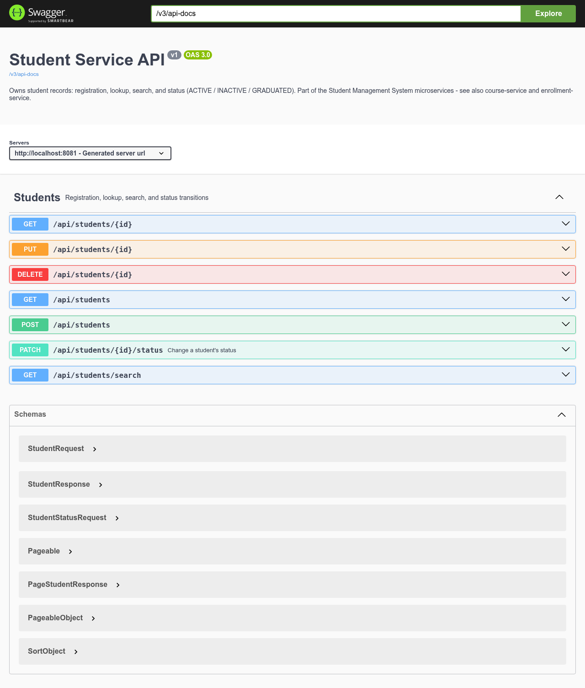
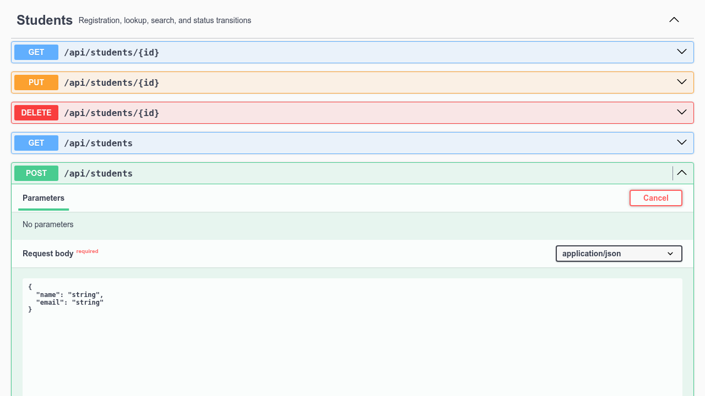

# Phase 8 — How to Use Swagger

Each of the three services documents itself. There's no single combined Swagger UI for the whole system — you pick the service whose API you want to explore, same way you'd pick which service's logs to read.

| Service | Swagger UI | Raw OpenAPI spec |
|---|---|---|
| student-service | http://localhost:8081/swagger-ui/index.html | http://localhost:8081/v3/api-docs |
| course-service | http://localhost:8082/swagger-ui/index.html | http://localhost:8082/v3/api-docs |
| enrollment-service | http://localhost:8083/swagger-ui/index.html | http://localhost:8083/v3/api-docs |

These ports are only reachable directly when running the services locally (`mvn spring-boot:run`) or via the Docker Compose stack's host port mappings (`8081`/`8082`/`8083`). The frontend's nginx proxy on `8080` only forwards `/api/*` — it does not proxy `/swagger-ui/*` or `/v3/api-docs`, so Swagger is a developer/testing tool, not something end users see through the app.

---

## 1. Opening a service's Swagger UI

Navigate to `http://localhost:8081/swagger-ui/index.html` (student-service, for example). You'll see:



- **Title, version, description** at the top — this is student-service's own `OpenApiConfig` bean talking.
- **Servers** dropdown — which host:port requests will actually be sent to. Leave this as the default (it auto-fills to wherever you loaded the page from).
- **Students** — one group per `@Tag` on the controller. Each service has exactly one tag group, since each service owns exactly one resource.
- Each row is one endpoint: method badge (color-coded — blue GET, green POST, orange PUT, teal PATCH, red DELETE), path, and a short description for endpoints where one was written (like `PATCH /api/students/{id}/status`).
- **Schemas** at the bottom — every request/response DTO, expandable to see field names, types, and which fields are required.

## 2. Trying an endpoint for real

Click any endpoint row to expand it, then **Try it out**:



Swagger UI pre-fills the request body with a schema-shaped example — edit it with actual values, e.g.:

```json
{
  "name": "Rahul Sharma",
  "email": "rahul@example.com"
}
```

Click **Execute**. Swagger UI sends the real HTTP request to the running service and shows you back:
- The exact `curl` command it just ran (useful for scripting the same call later)
- The response status code
- The response body
- Response headers

This is a genuinely working request against your running database — creating a student here creates a real row, the same as using the frontend or `curl` would.

## 3. A full walkthrough: create → enroll → hit the business rules

Since `enrollment-service` depends on the other two, test in this order:

1. **On `:8081` (student-service):** `POST /api/students` → note the returned `id`.
2. **On `:8082` (course-service):** `POST /api/courses` with a small `capacity` (e.g. `1`) → note the returned `id`.
3. **On `:8083` (enrollment-service):** `POST /api/enrollments`, filling in `studentId` and `courseId` as query parameters (Swagger UI shows them as separate input fields, not JSON, since they're `@RequestParam`, not `@RequestBody`) → should return `201`.
4. **Same endpoint again, same ids** → should return `409`, message `"Student X is already enrolled in course Y"`.
5. **Create a second student, enroll them into the same course** (capacity was `1`) → should return `409`, message `"Course Y is at capacity (1)"`.
6. **Back on `:8081`:** `PATCH /api/students/{id}/status` with `{"status": "GRADUATED"}` → `200`.
7. **Same endpoint, `{"status": "ACTIVE"}`** → `409`, message `"Cannot change student status from GRADUATED to ACTIVE"`.

Every one of these responses is visible directly in Swagger UI's response panel — no separate terminal needed.

## 4. Reading the schemas

Expand any entry under **Schemas** to see exactly what a DTO looks like on the wire, including which fields are required (marked in the panel) and their validation constraints where they're visible in the description (e.g. `capacity` on `CourseRequest` shows as an integer with a minimum). This is generated directly from the Java DTOs and their `jakarta.validation` annotations — it will never drift out of sync with the actual code, because it *is* the actual code, read at startup.

## 5. Common gotchas

- **A 404 from Swagger UI itself (not from the API)** almost always means you're hitting the wrong port — double check you're on `8081`/`8082`/`8083`, not `8080` (the frontend, which doesn't proxy Swagger).
- **Enrollment calls failing with a connection error inside enrollment-service**, not a clean 404/409 — means `student-service` or `course-service` isn't reachable from wherever `enrollment-service` is running. If you're running services individually via `mvn spring-boot:run`, confirm `STUDENT_SERVICE_URL`/`COURSE_SERVICE_URL` (or their `localhost:8081`/`8082` defaults) actually point somewhere alive.
- **Query parameters vs. request body** — `POST /api/enrollments` takes `studentId`/`courseId` as query parameters, not JSON, because the controller uses `@RequestParam`. Swagger UI renders these as separate text fields above the (absent) request body section, not inside a JSON editor — easy to miss the first time.
