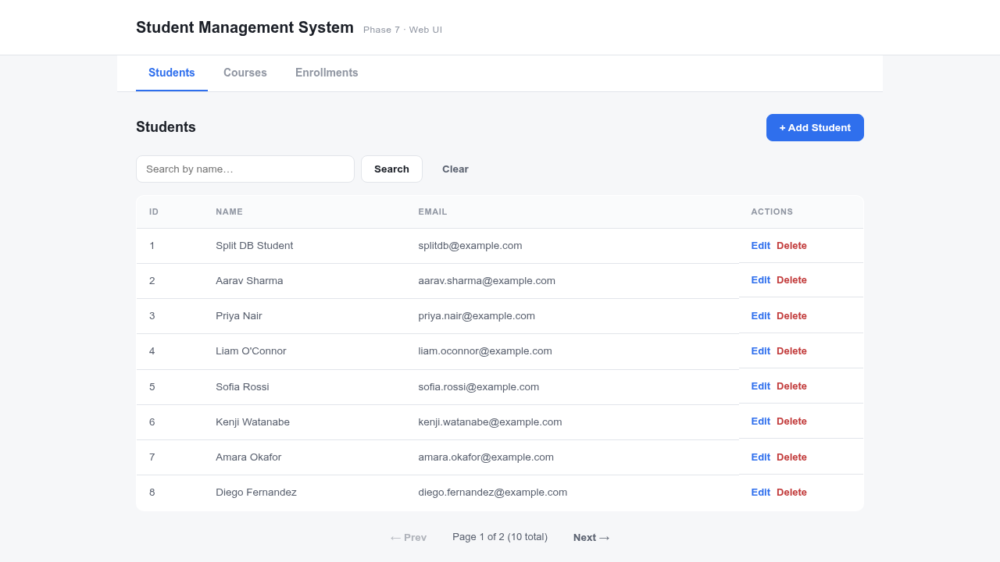
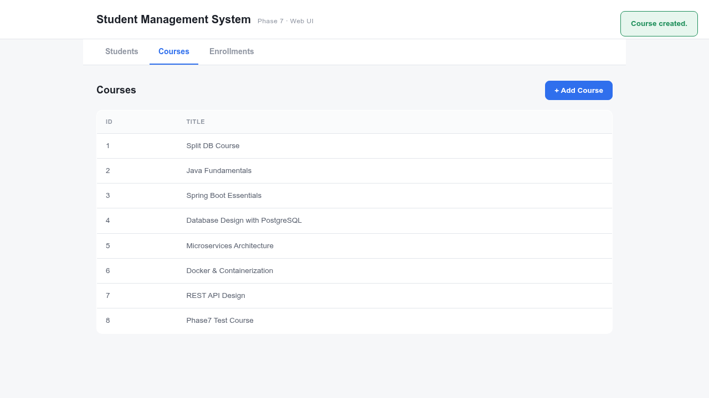
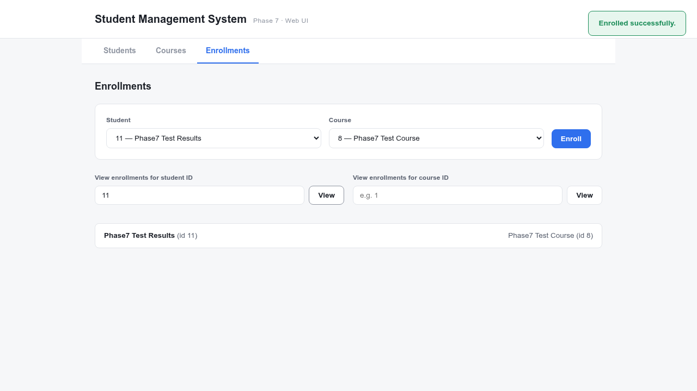

# Phase 7 — Manual Test Results

Executed against the running 7-container Phase 7 stack (`student-db`, `course-db`, `enrollment-db`, `student-service`, `course-service`, `enrollment-service`, `frontend`), driven through an actual headless browser hitting `http://localhost:8080/`. Captured 2026-08-17.

---

## 1. Students tab, through the proxy



✅ Loads correctly; seeded data from prior runs preserved via named volumes across `docker compose down`/`up` cycles.

---

## 2. Create student, create course

```
Toast: "Student created."
Toast: "Course created."
```



✅ Both requests correctly routed by nginx to `student-service` and `course-service` respectively — each writing to its **own** database.

---

## 3. Enroll + lookup — resolved entirely over HTTP, no shared table

Enrolled a fresh student into a fresh course, then looked up that student's enrollments:



```
Result: "Phase7 Test Results (id 11)" enrolled in "Phase7 Test Course (id 8)"
```

**Server-side log, same moment:**
```
INFO EnrollmentController : POST /api/enrollments studentId=11 courseId=8
INFO EnrollmentController : GET /api/enrollments/student/11
```

✅ The `studentName` and `courseTitle` shown came from real HTTP calls `enrollment-service` made to `student-service` and `course-service` — `enrollment-db` has no table, column, or any other way of knowing a student's name or a course's title.

---

## 4. Cross-service error handling over HTTP

```bash
$ curl -o /dev/null -w "%{http_code}\n" -X POST "localhost:8080/api/enrollments?studentId=99999&courseId=8"
404   # student-service returned 404, StudentClient translated it, EnrollmentService threw StudentNotFoundException

$ curl -o /dev/null -w "%{http_code}\n" -X POST "localhost:8080/api/enrollments?studentId=11&courseId=8"
409   # duplicate, caught by enrollment-service's own database query
```

✅ Both error paths work correctly: the 404 crosses two service boundaries (enrollment-service → student-service → back), the 409 is resolved entirely within enrollment-service's own database — confirming both halves of Phase 7's design.

---

## 5. Database isolation — the actual point of this phase

```bash
$ docker compose exec student-db psql -U stumgmt -d student_db -c "\dt"
 public | student | table | stumgmt

$ docker compose exec course-db psql -U stumgmt -d course_db -c "\dt"
 public | course | table | stumgmt

$ docker compose exec enrollment-db psql -U stumgmt -d enrollment_db -c "\dt"
 public | enrollment | table | stumgmt
```

✅ **Complete isolation confirmed.** Each database contains exactly one table — no `student` or `course` table anywhere near `enrollment-db`. This is the structural proof that `enrollment-service` cannot be reading a shared table anymore; the enrollment data shown in step 3 could only have come from the network.

---

## Summary

| Area | Status |
|---|---|
| All 7 containers up | ✅ Pass |
| Students/Courses tabs load through proxy | ✅ Pass |
| Create student / course through proxy | ✅ Pass |
| Enroll + lookup, resolved via real HTTP calls | ✅ Pass |
| 404 across service boundary (student-service → enrollment-service) | ✅ Pass |
| 409 within enrollment-service's own database | ✅ Pass |
| Three databases, zero shared tables | ✅ Pass — verified directly via `psql` on each container |
| Browser console errors | 0 |

All behavior matches what's documented in [`CHANGES.md`](./CHANGES.md) and [`DB-Schema-and-Ref-Values.md`](./DB-Schema-and-Ref-Values.md).
